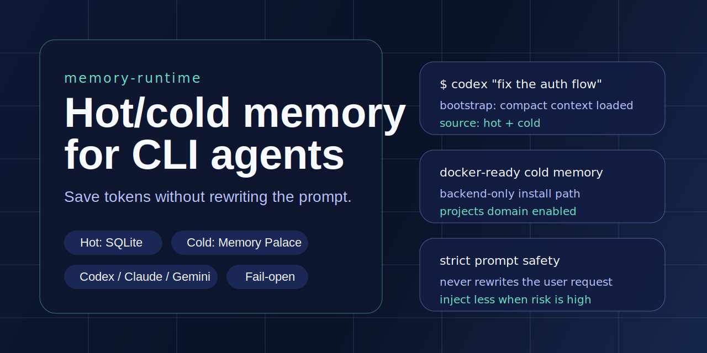

# memory-runtime



[](https://github.com/Tom-Wang898/memory-runtime/actions/workflows/ci.yml)
[](https://github.com/Tom-Wang898/memory-runtime/releases)
[](./LICENSE)
[](./package.json)

`memory-runtime` is a hot/cold memory runtime for CLI agents.

It is designed to save tokens without rewriting the user request, stay fail-open
under provider failures, and keep host integrations replaceable.

- Chinese quick start: `README_CN.md`
- Changelog: `CHANGELOG.md`

## Current status

This repo is ready for public GitHub use as an `0.x` GitHub-first runtime:

- hot memory is backed by local SQLite via `node:sqlite`
- cold memory can use a real Memory Palace backend
- Codex, Claude, and Gemini wrappers are implemented
- shell integration can be installed with one command
- cold-memory autostart is optional and fail-open

The current distribution model is:

- clone from GitHub
- run locally
- install shell integration into `zsh` or `bash`

It is not an npm-published product yet.

## Architecture

The runtime is split into replaceable layers:

- `memory-core`: contracts, token budget policy, routing rules
- `hot-memory-sqlite`: fast local hot-state provider
- `cold-memory-memory-palace`: cold-memory adapter for Memory Palace
- `cold-memory-fixture`: deterministic fixture adapter for tests and benchmarks
- `host-codex`: Codex bootstrap and checkpoint integration surface
- `host-claude`: Claude-oriented bootstrap rendering surface
- `mcp-bridge`: optional stdio bridge for inspection and promotion flows

```text
CLI host
-> host adapter
-> memory-core
-> hot provider
-> cold provider
```

## Design goals

- high cohesion, low coupling
- fail-open behavior that never blocks normal development
- fast local bootstrap with strict latency and token budgets
- replaceable hot and cold memory providers
- public-repo-friendly code with no bundled personal memory data

## Prerequisites

- Node.js `22+` with `node:sqlite` support
- npm `10+`
- at least one supported host CLI already installed: Codex, Claude, or Gemini
- `zsh` or `bash` if you want automatic wrapper loading
- optional: a running Memory Palace backend for cold recall
- optional for Docker cold memory: Docker with `docker compose`

## Quick start

1. Clone the repo and install dependencies:

```bash
git clone https://github.com/Tom-Wang898/memory-runtime.git
cd memory-runtime
npm install
```

2. Install shell integration:

```bash
./scripts/install-shell-integration.sh --shell zsh
```

Use `--shell bash` if you want `~/.bashrc` instead.

3. Reload the shell:

```bash
source ~/.zshrc
```

4. Verify the wrappers and hot-memory runtime:

```bash
codex --help
claude --help
gemini --help
hmctl bootstrap --cwd "$(pwd)" --mode warm --query "runtime smoke test" --json
```

If you stop here, the runtime already works in hot-memory mode and will fail open
if cold memory is unavailable.

## Optional cold-memory setup

Cold memory uses Memory Palace.

If you already run Memory Palace somewhere, set its base URL:

```bash
export MEMORY_RUNTIME_MP_BASE_URL="http://127.0.0.1:18000"
```

### Recommended Docker path

If you want a stable cold-memory setup without cloning the full Memory Palace
repo, use the backend-only installer:

```bash
./scripts/install-memory-palace-docker.sh
source ~/.memory-runtime/env.sh
```

That path:

- deploys the official GHCR backend image only
- generates a local API key by default
- enables the `projects` domain needed by `memory-runtime`
- writes shell exports to `~/.memory-runtime/env.sh`

### Existing full Memory Palace deployment

If you want `memory-runtime` to auto-start a local Memory Palace backend, also set:

```bash
export MEMORY_RUNTIME_MP_AUTOSTART=1
export MEMORY_RUNTIME_MP_BACKEND_ROOT=/absolute/path/to/Memory-Palace/backend
```

Autostart only attempts to run when:

- `MEMORY_RUNTIME_MP_AUTOSTART=1`
- the base URL is a loopback address
- the backend root contains both `main.py` and `.venv/bin/python`

If any of those checks fail, the runtime degrades gracefully and continues.

Docker deployments are treated differently:

- the wrapper does not try to start or stop Docker for you
- use `install-memory-palace-docker.sh` once, then keep `MEMORY_RUNTIME_MP_AUTOSTART=0`
- if you want the full Dashboard and SSE stack, use the official Memory Palace repo

See:

- `docs/COLD_MEMORY_DOCKER.md`
- `docs/CONFIGURATION.md`

## What gets installed

The shell installer injects a managed block into your shell rc file and wires:

- `hmctl`
- `memory_runtime_bridge`
- `codex`
- `claude`
- `gemini`

The wrappers:

- inject compact bootstrap context before a session starts
- keep the raw user prompt intact
- write a lightweight checkpoint after the wrapped command exits

## Validation

Run the full verification suite:

```bash
npm run check:all
```

Optional benchmarks:

```bash
npm run bench:bootstrap
npm run bench:tokens
```

## Repository docs

- `docs/ARCHITECTURE.md`
- `docs/COLD_MEMORY_DOCKER.md`
- `docs/DATA_CONTRACTS.md`
- `docs/CONFIGURATION.md`
- `docs/SAFETY.md`
- `docs/SOCIAL_PREVIEW.md`
- `docs/TROUBLESHOOTING.md`
- `docs/OPEN_SOURCE.md`
- `docs/RELEASE.md`
